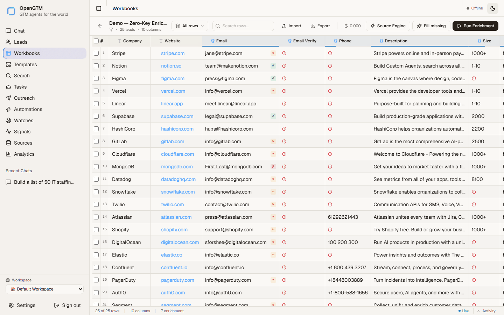

<p align="center">
  
</p>

<h1 align="center">OpenGTM</h1>

<p align="center"><strong>Your GTM data engine. Your keys. Your infrastructure.</strong></p>

<p align="center">
  Open-source lead sourcing, enrichment waterfalls, AI research, buying signals,<br />
  audiences, and activation—in one self-hosted workspace.
</p>

<p align="center">
  <a href="LICENSE"></a>
  <a href="https://opengtm.palash.dev"></a>
  <a href="https://github.com/debpalash/opengtm/stargazers"></a>
  <a href="https://github.com/debpalash/opengtm/pkgs/container/opengtm"></a>
</p>

<p align="center">
  <a href="#install">Install</a> ·
  <a href="#use-opengtm-from-your-ai-agent">Connect an agent</a> ·
  <a href="https://opengtm.palash.dev/compare/clay-alternative/">Compare with Clay</a> ·
  <a href="https://opengtm.palash.dev/api/">API</a>
</p>

<p align="center">
  
</p>

Give OpenGTM a market, a list, or a workbook. It finds companies and people,
fills rows through cost-ordered provider waterfalls, researches hard questions
with cited agents, watches for intent, and sends qualified records to the tools
your team already uses.

Unlike a hosted credit black box, OpenGTM shows the estimated bill before a run.
Your data stays on your machine; third-party calls use keys you choose.

## What you get

- **Clay-style workbooks** with formulas, HTTP columns, enrichment waterfalls,
  AI transforms, web research, conditional logic, and output columns.
- **Bring-your-own-key enrichment** across email, phone, firmographic,
  technographic, hiring, social, and identity providers.
- **Audience and signal loops** with scheduled refresh, entry/exit events,
  buying signals, automations, and durable retries.
- **Activation** to HubSpot, Salesforce, Slack, Sheets, Airtable, Instantly,
  Smartlead, webhooks, warehouses, and consent-gated ad audiences.
- **Agent access** through REST, webhooks, and a tenant-scoped, auditable MCP
  server with real read/write tools.
- **Production controls**: PostgreSQL RLS, scoped tokens, spend ceilings,
  idempotency, audit history, OIDC, SCIM, retention, and observable workers.

## Install

Requirements: Git, Docker, Docker Compose v2, and about 4 GB of RAM.

### One-command installer

macOS / Linux:

```bash
curl -fsSL https://raw.githubusercontent.com/debpalash/opengtm/main/scripts/install.sh | bash
```

Windows PowerShell:

```powershell
irm https://raw.githubusercontent.com/debpalash/opengtm/main/scripts/install.ps1 | iex
```

The installer checks prerequisites, clones OpenGTM, generates unique database,
JWT, runtime-role, and admin secrets, writes `.env`, then starts the stack. It
never replaces an existing `.env`. Initial login details are written to the
ignored `.opengtm-initial-credentials` file—use them once, change the password,
then delete the file.

Prefer to inspect scripts before running them? Use the explicit path:

```bash
git clone https://github.com/debpalash/opengtm.git
cd opengtm
./scripts/install.sh
```

```powershell
git clone https://github.com/debpalash/opengtm.git
cd opengtm
.\scripts\install.ps1
```

Open **http://localhost:3000**. The first boot includes a populated zero-key
demo, so you can explore a complete workbook before adding provider keys.

Useful commands:

```bash
docker compose ps                         # service health
docker compose logs -f api worker         # follow execution
docker compose up -d --scale worker=4     # increase throughput
docker compose down                       # stop; keep data
git pull && docker compose up -d --build  # upgrade
```

PostgreSQL is the primary store, Redis carries live progress, one scheduler
owns recurring work, and horizontally scalable workers claim durable jobs
without double-processing. Persistent data lives in Docker volumes and
`./data`; review the [production checklist](https://opengtm.palash.dev/self-hosting/production/)
before exposing the service to a network.

### Manual Compose setup

```bash
git clone https://github.com/debpalash/opengtm.git
cd opengtm
cp .env.example .env
docker compose up -d --build
```

The manual defaults are intended only for a laptop and use `admin` / `admin`.
Change `SECRET_KEY`, `POSTGRES_PASSWORD`, `YUPCHA_RUNTIME_DB_PASSWORD`, and
`SEED_ADMIN_PASSWORD` before any shared deployment. Provider keys are optional
and can be added later under **Settings → API Keys**.

## Use OpenGTM from your AI agent

OpenGTM ships an MCP server, so Codex, Claude Code/Desktop, Pi, OpenCode, Cursor,
Windsurf, and other MCP clients can inspect pipeline data and run approved GTM
actions without screen-driving the UI.

### 1. Mint a workspace token

Sign in as a workspace admin, then create a token from the API. The plaintext
`ycp_...` value is shown once; only its hash is stored.

```bash
# Login is form-encoded—not JSON. Copy access_token from this response.
curl -X POST http://localhost:3000/auth/token \
  -H "Content-Type: application/x-www-form-urlencoded" \
  --data-urlencode "username=admin" \
  --data-urlencode "password=YOUR_GENERATED_ADMIN_PASSWORD"

export OPENGTM_ACCESS_TOKEN="paste-access_token-here"

curl -X POST http://localhost:3000/api/mcp/tokens \
  -H "Authorization: Bearer $OPENGTM_ACCESS_TOKEN" \
  -H "Content-Type: application/json" \
  -d '{"name":"my-agent","capabilities":["leads:read"],"ttl_days":90}'
```

Start read-only. To expose write tools, grant only the needed capabilities and
set `MCP_WRITE_ENABLED=1`. Writes are role-checked, capped, idempotent, and
audited; destructive and send operations require an admin role.

### 2. Point your client at the stdio server

Use this standard MCP server object in Claude Code/Desktop or any client that
accepts `mcpServers` JSON. It runs the stdio bridge inside the existing API
container, where the database and Python environment are already configured.
Replace the Compose-file path and token:

```json
{
  "mcpServers": {
    "opengtm": {
      "command": "docker",
      "args": [
        "compose", "-f", "/absolute/path/to/opengtm/docker-compose.yml",
        "exec", "-T", "-e", "OPENGTM_MCP_TOKEN",
        "api", "python", "-m", "apps.mcp.server"
      ],
      "env": { "OPENGTM_MCP_TOKEN": "ycp_..." }
    }
  }
}
```

For Codex, the equivalent `~/.codex/config.toml` entry is:

```toml
[mcp_servers.opengtm]
command = "docker"
args = ["compose", "-f", "/absolute/path/to/opengtm/docker-compose.yml", "exec", "-T", "-e", "OPENGTM_MCP_TOKEN", "api", "python", "-m", "apps.mcp.server"]

[mcp_servers.opengtm.env]
OPENGTM_MCP_TOKEN = "ycp_..."
```

| Client | Where to add OpenGTM |
|---|---|
| **Codex CLI/Desktop** | `~/.codex/config.toml`, using the TOML above |
| **Claude Code** | Project `.mcp.json` or `claude mcp add`; use the standard JSON server object |
| **Claude Desktop** | `claude_desktop_config.json` under `mcpServers` |
| **OpenCode** | Add a local MCP server in `opencode.json`; use the same command array and environment variable |
| **Pi** | Add the server through an MCP extension/adapter; command, args, and token are identical |
| **Cursor / Windsurf** | Add the same stdio MCP server object |

For native development or loopback HTTP transport, see the complete
[MCP guide](https://opengtm.palash.dev/integrations/mcp/) and
[copyable config](docs/examples/mcp-config.json).

## Architecture

```text
browser / REST / MCP
         │
         ▼
FastAPI ──► PostgreSQL + forced workspace RLS
   │                    │
   ├──► Redis progress  └──► durable job queue
   │                              │
   └──────────────────────────────▼
                         workers + scheduler
                              │
           providers / web / CRM / warehouse / ads
```

| Path | Purpose |
|---|---|
| `apps/api` | FastAPI, workbook engine, providers, agents, queue, governance |
| `apps/web` | React, TypeScript, Tailwind, virtualized workbook UI |
| `apps/mcp` | Authenticated MCP server for desktop and CLI agents |
| `apps/docs` | Documentation and generated OpenAPI reference |
| `packages` | Chrome extension and n8n community node |

Read the [architecture guide](docs/architecture.md) for ownership, tenancy,
failure behavior, and scale limits.

## Honest status

OpenGTM implements the core discover → enrich → segment → act → learn loop. It
is not a pixel-for-pixel Clay clone, and the provider/integration catalog is
still growing. Features remain `beta` until build-bound, signed controlled-live
evidence proves the supported workflow; the public
[parity roadmap](docs/plans/clay-suite-parity.md) tracks that boundary.

For mutually hostile public tenants, complete the documented egress, Vault,
backup/restore, controlled-live identity-provider, scale, and security-review
gates first. For a team-controlled single-node deployment, Compose is the
supported self-host shape today.

## Contributing

Issues, provider requests, docs fixes, and focused pull requests are welcome.
Start with [CONTRIBUTING.md](CONTRIBUTING.md) and the
[documentation](https://opengtm.palash.dev).

## License

[GNU AGPL-3.0](LICENSE). Internal self-hosting is allowed. If you offer a
modified OpenGTM to users over a network, the AGPL source-availability clause
applies. This summary is not legal advice.
