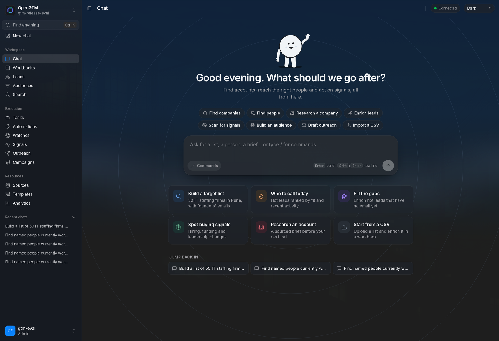

<p align="center"></p>
<h1 align="center">OpenGTM</h1>
<p align="center">An open-source, self-hosted workspace for GTM teams and their agents.</p>
<p align="center">
  <a href="https://opengtm.palash.dev">Docs</a> ·
  <a href="#run-it">Install</a> ·
  <a href="https://github.com/debpalash/OpenGTM/releases">Releases</a> ·
  <a href="LICENSE">AGPL-3.0</a>
</p>

<p align="center"></p>

Give OpenGTM a market, a list, or a workbook. It finds companies and people,
enriches rows through cost-ordered provider waterfalls, researches hard questions
with cited agents, watches for buying intent, and sends qualified records to
the tools your team already uses. Your data stays on your infrastructure;
third-party calls use keys you choose. A zero-key demo is included.

## Run it

You need **Git, Docker with Compose v2, and roughly 4 GB of available RAM**.
No provider key is required to try the demo.

### On your laptop

macOS or Linux:

```bash
git clone https://github.com/debpalash/OpenGTM.git
cd OpenGTM
./scripts/install.sh
```

Windows PowerShell with Docker Desktop:

```powershell
git clone https://github.com/debpalash/OpenGTM.git
Set-Location OpenGTM
.\scripts\install.ps1
```

Open **http://localhost:3000**. Sign in with the generated admin password in
`.opengtm-initial-credentials` (ignored by Git; do not share it). The installer
generates database, runtime-role, and signing secrets, creates a writable data
directory, then starts the stack. It leaves an existing `.env` untouched. Change
the admin password after signing in and remove the credentials file.

### On a server

Use a versioned checkout and image. Point a domain at the host and provide a
TLS reverse proxy such as Caddy; the app itself stays on loopback. On a Linux
host with Git and Docker Compose:

```bash
git clone --depth 1 --branch v3.0.0 https://github.com/debpalash/OpenGTM.git
cd OpenGTM
./scripts/install.sh --no-start
DOMAIN=gtm.example.com                 # replace with your domain
cat >> .env <<EOF
APP_ENV=production
PORT=127.0.0.1:3000
CORS_ORIGINS=https://$DOMAIN
YUPCHA_IMAGE=ghcr.io/debpalash/opengtm:3.0.0
EOF
docker compose pull
docker compose up -d --no-build
```

For Caddy, a site block is enough once DNS points at the server and ports 80/443
are open:

```caddyfile
gtm.example.com {
    reverse_proxy 127.0.0.1:3000
}
```

Open `https://gtm.example.com` and use the generated credentials file. Replace
the example domain in both commands and Caddy config. The installer-generated
secrets satisfy production startup checks; `PORT=127.0.0.1:3000` keeps the
bundled HTTP listener private. PostgreSQL, Redis, and the API bind to loopback
or the internal Compose network. Set up backups and review the
[production checklist](https://opengtm.palash.dev/self-hosting/production/)
before inviting a team. Never expose port 3000 directly over the internet.

For a new release, fetch its tag, check it out, update `YUPCHA_IMAGE` in `.env`
to the same version, then run `docker compose pull && docker compose up -d
--no-build`. Keep the existing `.env`, `data/`, and Docker volumes when
upgrading. The [Docker guide](https://opengtm.palash.dev/self-hosting/docker/)
explains the services and scaling.

### Operate it

```bash
docker compose ps                         # service health
docker compose logs -f api worker         # follow jobs
docker compose up -d --scale worker=4     # add capacity
docker compose down                       # stop without deleting data
```

## What you can build

- **Workbooks:** import leads, add formulas, HTTP columns, enrichment waterfalls,
  AI research, and output columns. Estimated spend is shown before a run.
- **Live audiences:** segment records, watch hiring and buying signals, and
  trigger scheduled refreshes and automations.
- **Activation:** connect HubSpot, Salesforce, Slack, Sheets, Airtable,
  Instantly, Smartlead, webhooks, warehouses, or consent-gated ad audiences.
- **Agent access:** use the same workspace through REST, webhooks, and an
  auditable MCP server with scoped read/write capabilities.

Provider keys are optional at install. Add them under **Settings → API Keys**
when you're ready to use paid or authenticated providers.

## Connect an AI agent

Create a workspace token from an admin session, then give your MCP client a
read-only token first. The server runs inside the existing API container:

```json
{
  "mcpServers": {
    "opengtm": {
      "command": "docker",
      "args": [
        "compose", "-f", "/absolute/path/to/OpenGTM/docker-compose.yml",
        "exec", "-T", "-e", "OPENGTM_MCP_TOKEN",
        "api", "python", "-m", "apps.mcp.server"
      ],
      "env": { "OPENGTM_MCP_TOKEN": "YOUR_WORKSPACE_TOKEN" }
    }
  }
}
```

See the [MCP guide](https://opengtm.palash.dev/integrations/mcp/) for token
creation, Codex/Claude/Pi/OpenCode setup, HTTP transport, and safe write scopes.

## How it fits together

```text
browser / REST / MCP
         │
         ▼
FastAPI ──► PostgreSQL + forced workspace RLS
   │                    │
   ├──► Redis progress  └──► durable job queue
   │                              │
   └──────────────────────────────▼
                         workers + scheduler
                              │
           providers / web / CRM / warehouse / ads
```

`apps/api` owns the backend, `apps/web` the React UI, `apps/mcp` the agent
bridge, and `apps/docs` the documentation. Read the
[architecture guide](docs/architecture.md) for tenancy and failure behavior.

## Scope and contribution

OpenGTM covers the discover → enrich → segment → act → learn loop. It is not a
pixel-for-pixel Clay clone, and the provider catalog is still growing. Public
multi-tenant hosting needs additional egress, identity, custody, restore, and
security-review work beyond the supported team-controlled Compose deployment;
see the [parity roadmap](docs/plans/clay-suite-parity.md).

Issues, provider requests, docs fixes, and focused pull requests are welcome.
Start with [CONTRIBUTING.md](CONTRIBUTING.md). Licensed under
[GNU AGPL-3.0](LICENSE); network use of modified versions carries source
availability obligations.
